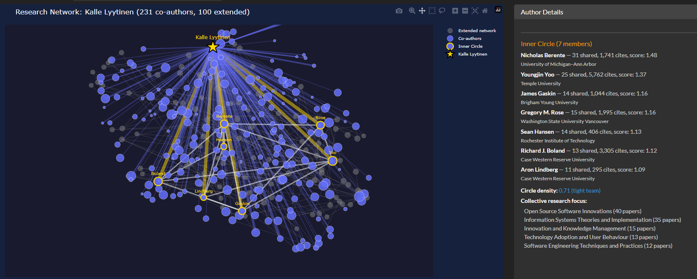
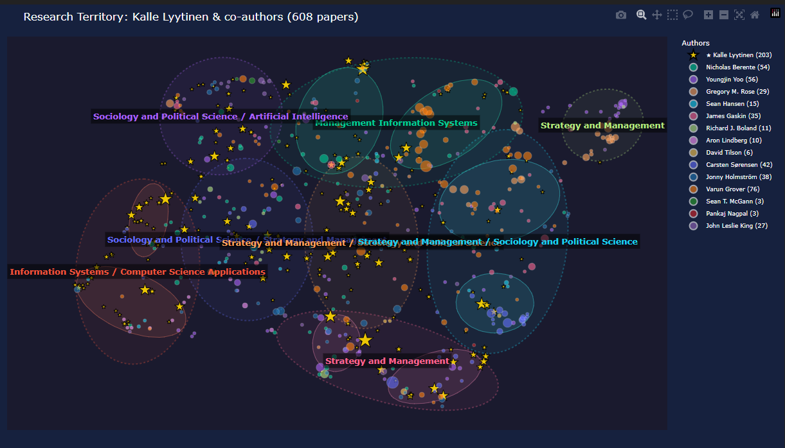
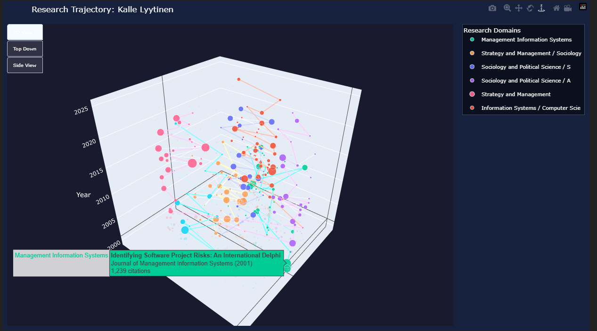
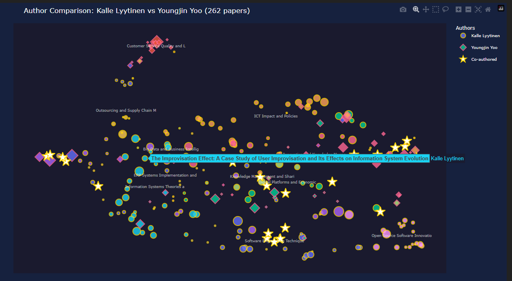
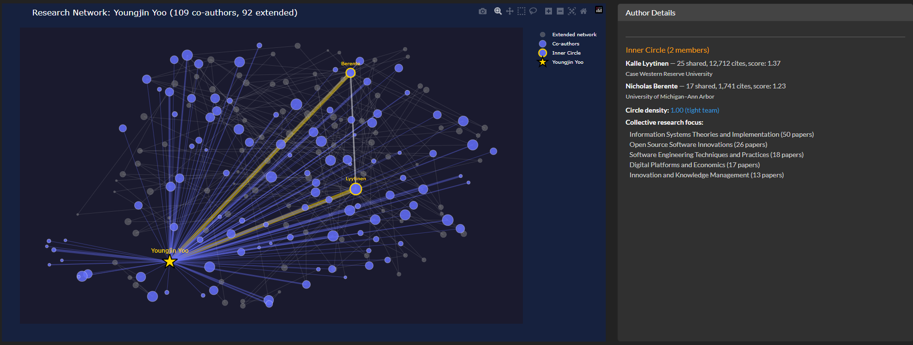
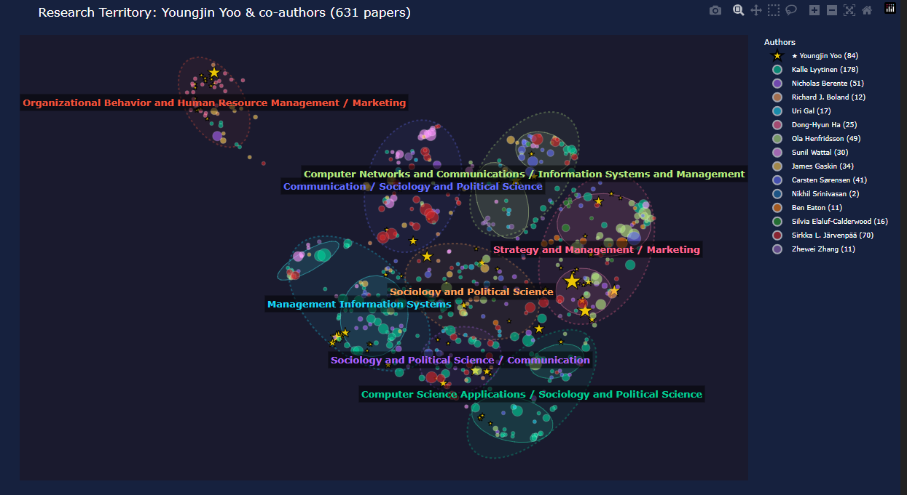
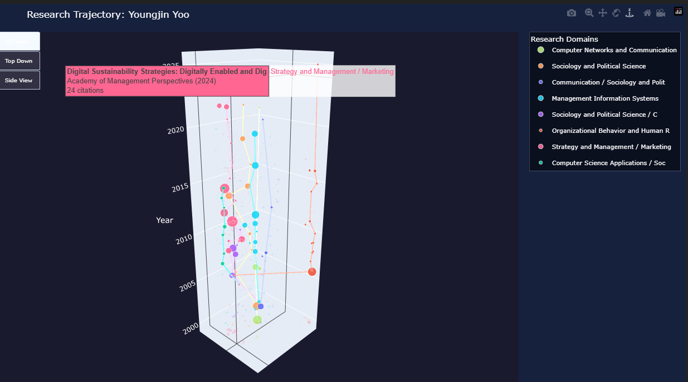

# Academic Atlas

> Interactive map of **455 million academic papers** — search, explore, and compare authors across the entire research landscape.


Academic Atlas turns the **entire OpenAlex corpus** (455M papers across 26 fields) into an interactive, semantically-zoomable map. Explore how research has evolved from 1763 to 2025, compare authors' intellectual footprints, and discover cross-disciplinary connections.

---

## Why

Traditional academic search returns ranked lists. But research is structured as a *landscape* — with continents (fields), islands (subfields), and bridges between them (interdisciplinary work). Academic Atlas renders this landscape as a map you can navigate.

Use cases:
- **Researchers** — find adjacent fields to your work, spot research gaps, identify potential collaborators
- **PhD students** — place your dissertation in the broader scholarly context
- **Institutions** — benchmark faculty portfolios against the global research landscape
- **Recruiters / job seekers** — visualize an author's research trajectory at a glance

---

## Features

### 1. World Map with Semantic Zoom + Time Slider

A pre-built landscape of **~50K high-impact papers** (≥500 citations) sampled via square-root proportional stratification across 26 OpenAlex fields, producing **157 topic clusters**.

- **Semantic zoom** — cluster labels appear progressively as you zoom in (field → subfield → topic)
- **GPU-rendered** via deck.gl — smooth interaction with 50K+ points
- **CT-scan time slider** — drag through years to see research evolve. Uses deck.gl's `DataFilterExtension` for zero-lag GPU-based filtering
- **Cumulative mode** shows all papers up to year Y; **slice mode** shows only papers from year Y

### 2. Author Landscape

Search any author → disambiguate from candidates (with institution, citation count, top paper) → confirm → build the full landscape.

#### Co-author Network with Inner Circle Detection


2-layer ego network with **automatic inner-circle detection** using a composite score: `frequency × recency × Jaccard similarity`. Gold-bordered nodes are the focal author's closest collaborators. Hover for paper details.

#### Research Territory


KDE-based territorial map showing how an author's research spans different intellectual territories. Labels describe each territory using OpenAlex topic hierarchy (Strategy and Management, Information Systems, Organizational Behavior, etc.).

#### 3D Research Trajectory


Z-axis = time. See how a scholar's research focus shifted over decades. Each dot is a paper; colors are research domains; lines connect papers in the same research thread chronologically.

### 3. Multi-Author Comparison



Select up to 5 authors → project all their papers into a **shared embedding space**. Each author gets a unique marker shape (circle, diamond, square, triangle, cross) and border color. **Co-authored papers appear as gold stars** — instantly see where scholars overlap in research space.

Example above: **Kalle Lyytinen vs Youngjin Yoo** (262 papers). The gold stars reveal their co-authorship clusters across Software Engineering, Information Systems Theories, and Digital Platforms.

### 4. AI Research Assistant

Type a research idea in natural language. Claude (with tool use) queries the 251M-paper SQLite FTS5 index, returns relevant papers, and you can visualize them as a focused map.

Powered by:
- **Claude Sonnet 4.6** with tool use for agentic search
- **SQLite FTS5** full-text index with BM25 ranking
- **sentence-transformers (MiniLM-L6-v2)** for 384-dim embeddings
- **BERTopic / KMeans + UMAP** for clustering and 2D projection

---

## Demo Author: Youngjin Yoo (Case Western)

Digital Innovation scholar, 109 co-authors, 631 papers.

| Co-author Network | Research Territory | 3D Trajectory |
|---|---|---|
|  |  |  |

The trajectory view reveals how Yoo's work expanded from early IT strategy research (~2000s) into Digital Platforms and Sustainability (~2020s), with a visible shift in research domain centroids over time.

---

## Architecture

```
OpenAlex Snapshot (583 GB, 455M papers)
  ↓ extract_to_parquet.py  [20 hours]
Parquet Lakehouse (193 GB, year-partitioned)
  ↓ build_derived.py       [~24 hours total]
  ├── analytics.duckdb  (453 GB) — analytics queries
  ├── search.db         (336 GB) — SQLite FTS5, 251M articles
  ├── authors.parquet   (2.8 GB) — 109M deduplicated authors
  └── worldmap_clustered.csv — pre-built world map
  ↓ app.py
Dash Web App (deck.gl + Plotly + Claude API)
```

**Why Lakehouse Lite?**
- **Parquet** = source of truth (cheap, columnar, reprocessable)
- **DuckDB** = analytics (group-by, aggregation)
- **SQLite FTS5** = full-text search (BM25, fast)
- **Every derived DB is rebuildable from Parquet** — if schema changes, just rerun

---

## Tech Stack

| Layer | Tool |
|---|---|
| Data source | OpenAlex Snapshot (S3) |
| Storage format | PyArrow Parquet |
| Analytics | DuckDB |
| Search | SQLite FTS5 |
| Embeddings | sentence-transformers (all-MiniLM-L6-v2) |
| Clustering | BERTopic, KMeans, HDBSCAN |
| Dim. reduction | UMAP |
| Map rendering | deck.gl (via datamapplot) |
| Charts | Plotly |
| Web framework | Dash + Dash Bootstrap Components |
| LLM | Anthropic Claude API (tool use) |
| Remote access | Tailscale |

---

## Getting Started

### Prerequisites
- **Python 3.12+**
- **~800 GB free disk** (for full OpenAlex extraction)
- **32 GB RAM** recommended (16 GB works with reduced sample sizes)
- **Anthropic API key** (optional, for the AI Research Assistant)

### Full pipeline
```bash
# 1. Download OpenAlex snapshot (~583 GB, S3)
python download_openalex.py

# 2. Extract to Parquet (~20 hours)
python extract_to_parquet.py

# 3. Build derived databases (~24 hours total)
python build_derived.py all

# 4. Build the world map (~25 minutes)
python build_derived.py worldmap

# 5. Launch the app
python app.py  # → http://localhost:8050
```

### Remote access via Tailscale
```bash
# App binds to 0.0.0.0 — any device on your tailnet can access
# Find your Tailscale IP:
tailscale ip
# Then visit: http://<your-tailscale-ip>:8050
```

---

## Design Decisions

- **Square-root proportional sampling** — Medicine (36M papers) and Dentistry (750K) both get represented fairly. Equal allocation over-represents small fields; pure proportional makes them invisible. Square-root is the academic standard for stratified science-mapping sampling.

- **OpenAlex topic labels > TF-IDF** — TF-IDF produces label soup like "blockchain, blockchain technology, blockchainbased, technology, blockchains". OpenAlex gives "Blockchain Technology and Applications" — human-readable and semantically coherent.

- **Deduplicated cluster labels** — Two clusters can both be dominantly "Technology Adoption" papers while occupying different positions in embedding space. We deduplicate labels (largest cluster gets the clean label, others fall back to TF-IDF) so each region has a unique identifier.

- **GPU-based time filtering** — Re-rendering 50K points on every slider tick lags. `DataFilterExtension` changes a single GPU uniform; the data stays loaded. Smooth even on a laptop.

- **Author disambiguation before embedding** — "Jun Xiang" returns 21 different people at different institutions. Show candidates with institution + top paper; require explicit **Confirm** before running the expensive ego-network build.

---

## Status

**v0.5** (2026-04) — Current
- [x] Full Lakehouse Lite (455M papers)
- [x] World Map with sqrt-proportional sampling
- [x] CT scan time slider (deck.gl DataFilterExtension)
- [x] Author disambiguation + confirm flow
- [x] Multi-author comparison with cluster labels
- [x] Remote access via Tailscale

**Roadmap** (see [BACKLOG.md](BACKLOG.md))
- [ ] Research gap detection (click empty region → LLM analyzes potential cross-disciplinary opportunities)
- [ ] Semantic search (embedding similarity, not just keyword)
- [ ] Citation network visualization
- [ ] Docker deployment

---

## License

MIT License — see [LICENSE](LICENSE).

Built on open data ([OpenAlex](https://openalex.org/)) and open tooling.

---

## Author

[@jscmp4](https://github.com/jscmp4) — PhD student researching online communities, computational social science, and AI agents.
