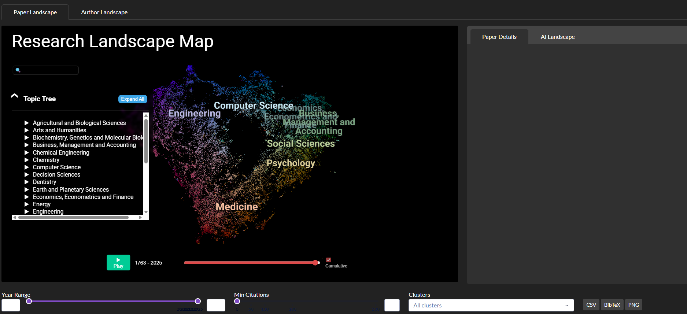

# Academic Atlas

> Interactive map of **455 million academic papers** — search, explore, and compare authors across the entire research landscape.



Academic Atlas turns the **entire OpenAlex corpus** (455M papers across 26 fields) into an interactive, semantically-zoomable map. Explore how research has evolved from 1763 to 2025, compare authors' intellectual footprints, and discover hidden cross-disciplinary connections.

---

## Why

Traditional academic search returns ranked lists. But research is structured as a *landscape* — with continents (fields), islands (subfields), and bridges between them (interdisciplinary work). Academic Atlas renders this landscape as a map you can actually navigate.

Use cases:
- **Researchers** — find adjacent fields to your work, spot research gaps, identify potential collaborators
- **PhD students** — place your dissertation in the broader scholarly context
- **Institutions** — benchmark faculty portfolios against the global research landscape
- **Job seekers / recruiters** — visualize an author's research trajectory at a glance

---

## Features

### World Map
A pre-built landscape of **~50K high-impact papers** (≥500 citations) sampled via square-root proportional stratification across 26 OpenAlex fields, producing 157 topic clusters.

- **Semantic zoom** — cluster labels appear progressively as you zoom in (field → subfield → topic)
- **GPU-rendered** via deck.gl — smooth interaction with 50K+ points
- **150+ research clusters** auto-labeled from OpenAlex topics (not raw TF-IDF keywords)

### CT Scan Time Slider


Watch academia evolve year by year. The time slider uses deck.gl's `DataFilterExtension` for **GPU-based filtering** — all 50K points stay loaded, only visibility changes. Zero lag.

- **Cumulative mode** — show all papers up to year Y
- **Slice mode** — show only papers from year Y (true CT-scan cross-section)
- **Play button** — auto-animate through history

### AI Research Assistant


Type a research idea in natural language. Claude uses tool-use to query the 251M-paper SQLite FTS5 index, then returns papers matching your intent. Click **Visualize** to generate a focused map of just those papers.

Powered by:
- **Claude Sonnet 4.6** with tool use
- **SQLite FTS5** full-text index (BM25 ranking)
- **sentence-transformers (MiniLM-L6-v2)** for embeddings
- **BERTopic / KMeans** for clustering

### Author Landscape


Search any author → see their **ego network**:
- **Co-author Network** — 2-layer network with inner circle detection (composite score: frequency × recency × Jaccard similarity)
- **Research Territory** — KDE-based territorial map of their papers
- **3D Trajectory** — time-based 3D visualization of their intellectual journey

**Disambiguation built-in** — search "Jun Xiang" and see 10 candidates with institution, papers, and top-cited work. Confirm the right one before building.

### Multi-Author Compare


Select up to 5 authors, project all their papers into a shared embedding space. Each author gets a unique marker shape and color. Co-authored papers appear as gold stars — instantly see their collaboration patterns and research overlap.

---

## Architecture

```
OpenAlex Snapshot (583 GB, 455M papers)
  ↓ extract_to_parquet.py  [20 hours]
Parquet Lakehouse (193 GB, year-partitioned)
  ↓ build_derived.py       [~24 hours total]
  ├── analytics.duckdb  (453 GB) — analytics queries
  ├── search.db         (336 GB) — SQLite FTS5, 251M articles
  ├── authors.parquet   (2.8 GB) — 109M deduplicated authors
  └── worldmap_clustered.csv — pre-built world map
  ↓ app.py
Dash Web App (deck.gl + Plotly + Claude API)
```

**Why Lakehouse Lite?**
- **Parquet** = source of truth (cheap, columnar, reprocessable)
- **DuckDB** = analytics (group-by, aggregation)
- **SQLite FTS5** = full-text search (BM25, fast)
- **Every derived DB is rebuildable from Parquet** — if schema changes, just rerun

---

## Tech Stack

| Layer | Tool |
|---|---|
| Data | OpenAlex Snapshot, PyArrow Parquet |
| Storage | DuckDB, SQLite FTS5 |
| Embeddings | sentence-transformers (MiniLM-L6-v2, 384-dim) |
| Clustering | BERTopic, KMeans, HDBSCAN |
| Dimensionality Reduction | UMAP |
| Visualization | deck.gl (via datamapplot), Plotly |
| Web Framework | Dash (Plotly), Dash Bootstrap Components |
| LLM | Anthropic Claude API (tool use) |
| Remote Access | Tailscale |

---

## Getting Started

### Prerequisites
- **Python 3.12+**
- **~800 GB free disk** (for full OpenAlex extraction)
- **32 GB RAM** (16 GB works with reduced sample sizes)

### Option 1: Run with your own data
```bash
# 1. Download OpenAlex snapshot (~583 GB)
python download_openalex.py

# 2. Extract to Parquet (~20 hours)
python extract_to_parquet.py

# 3. Build derived databases (~24 hours total)
python build_derived.py all

# 4. Build the world map (~25 minutes)
python build_derived.py worldmap

# 5. Launch the app
python app.py  # → http://localhost:8050
```

### Option 2: Skip the data pipeline
If you only want to explore a subset of papers, the AI Research Assistant can work with on-the-fly search results without needing the full lakehouse.

---

## Design Decisions

- **Square-root proportional sampling** — Medicine (36M papers) and Dentistry (750K) both get represented fairly. Pure proportional would make small fields invisible; equal allocation would over-represent small fields. Square-root is the academic standard (Bornmann et al.).

- **OpenAlex topic labels > TF-IDF** — TF-IDF produces "blockchain, blockchain technology, blockchainbased, technology, blockchains". OpenAlex gives "Blockchain Technology and Applications". The latter is a human-readable topic, not a keyword soup.

- **Deduplicated labels** — Two clusters can both be dominantly "Technology Adoption" papers but occupy different positions in embedding space. We deduplicate labels so each cluster has a unique identifier, falling back to TF-IDF keywords only when needed.

- **GPU-based time filtering** — Re-rendering 50K points on every slider tick is slow. `DataFilterExtension` changes a single GPU uniform; the data stays loaded.

---

## Status

**v0.5 (2026-04)** — Current
- [x] Full Lakehouse Lite (455M papers)
- [x] World Map with sqrt-proportional sampling
- [x] CT scan time slider
- [x] Author disambiguation + confirm flow
- [x] Multi-author comparison

**Roadmap** (see [BACKLOG.md](BACKLOG.md))
- [ ] Research gap detection (click empty region → LLM analyzes potential cross-disciplinary opportunities)
- [ ] Semantic search (embedding similarity, not just keyword)
- [ ] Citation network visualization
- [ ] Docker deployment

---

## License

MIT License — see [LICENSE](LICENSE) file.

Built on open data ([OpenAlex](https://openalex.org/)) and open tooling.

---

## Author

[@jscmp4](https://github.com/jscmp4) — PhD student researching online communities, computational social science, and AI agents.
